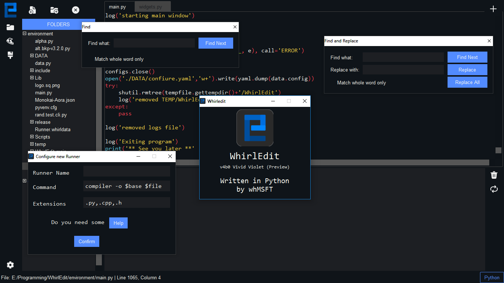

# NOTE: v4.0 is going to be released on 28th October 2021
## on the occassion of Bill Gates 66th BirthDay

<hr>

### Latest Stable release : [v3.4](https://github.com/Whirlpool-Programmer/WhirlEdit/releases/tag/v3.4)
### Latest preview release: [v4b0](https://github.com/Whirlpool-Programmer/WhirlEdit/releases/tag/v4b0)
<hr>

[](https://repl.it/github/whirlpool-programmer/WhirlEdit)
[](https://github.com/whmsft/whirledit/actions/workflows/python-app.yml)
[](https://www.python.org/)
[](https://github.com/whirlpool-programmer/whirledit/blob/master/LICENSE)
[]() 
[]()
[]()

WhirlEdit in v4 (preview) as of 24th October 2021



### Under development: v4 (Visual Vector)

features of Visual Vector:
1. able to run on Linux
2. Code has been formatted BETTER
3. all external widgets are available in `widgets.py`
4. the data for default conf, icon in data format, etc. is in `data.py`
5. Complete UI change with `ttkbootstrap`
6. introduction to Monokai-Aora (theme & scheme)
8. auto indent, create an (auto) indent when last line is indented
9. Welcome Screen
10. Improved CustomNotebook and a better close icon
11. an all NEW updating feature

```
CHANGELOG:

v3.5:
> bugfixes
  - syntax dropdown chooser
> UI
  + new style syntax change button
> features
  + an image previewer (VERY EXPERIMENTAL!)
  + raise error on UnicodeDecodeError
 
v3.4:
> bug fixes
> UI
  + better about window
> features
  + Find
  + Find & replace

v3.2.2:
> refix bug
  - font with ' '
> UI
  + Tab with close button
> features
  + runners saved in 'confscript'

v3.1.1:
> bugfixes
  - unable to update config
  - program crashes with font names having space ' ' character
> UI
  + added a "Confirm & Save" button to Settings pane

v3.1:
> Side Bar pane(s)
> Configuration File
> Many themes
> Many syntax Support
> simple terminal
> Ease of use 
> Tooltips for ease of use

v2:
> complete rewrite
> python syntax
> tabs
> scrollbar fix
> key bindings
> runner
> new theme (azure ttk theme)
> made with ttk instead of tk

v1:
> initial
```
<br>
<hr>

## Known issues (that can't be fixed in the nearby future):

1. Editing LARGE files (30kb+) may slow down loading & customization experience.

2. Lots of images aren't supported by the image previewer.

3. The error handler is not so advanced.. so in case of Error, a popup displays the error and the editor crashes.

4. Multi-line strings/comments are not highlighted due to a "pygments" problem

<hr>

## Questions:

1. What is the codename scheme?

\> An adjective and a noun with same initials (currently preview is at "V": "Visual Vector")

2. Why i made whirledit?

\> This project started as a simple project on my way learning tkinter Later, in May-June 2021 The project restarted as i got ideas for tabs and using "ttk".

<hr>

# And now something completely different:


(c) 2020-21 WhMSFT (penguin.wp OR Whirlpool-programmer)